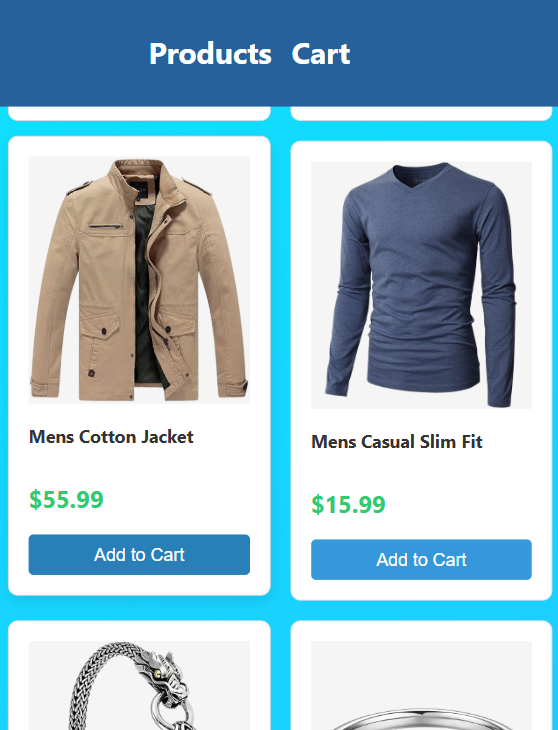
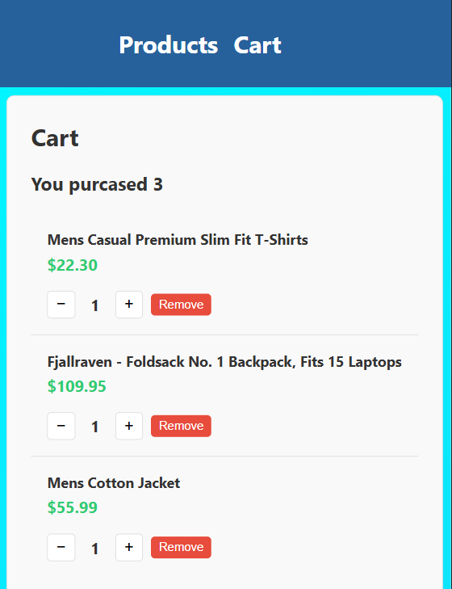
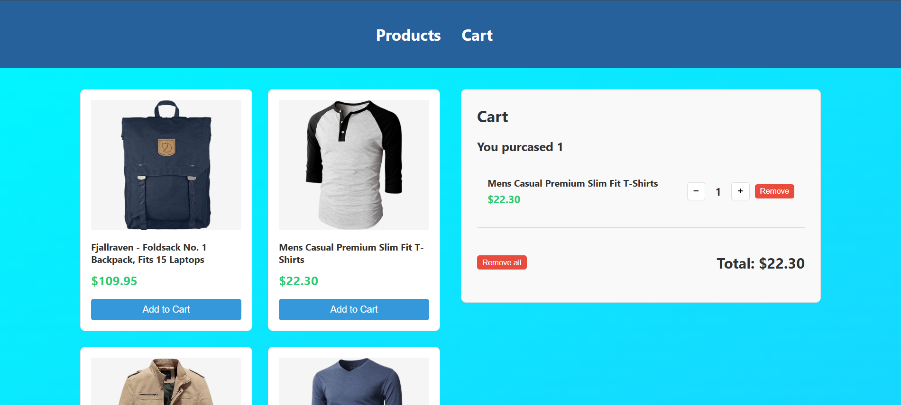

• Имя: Асрор
• Сколько времени заняло: 2 часа на основной функционал, 1,5 часа на дизайн
• Что было сложным: манипуляция элементами корзины - добавление, удалениеб увеличение и уменьшение количества
• Скриншоты интерфейса:   
• Ссылка на демо (если есть): [демо](https://doublebow1.github.io/mini-marketplace/)
